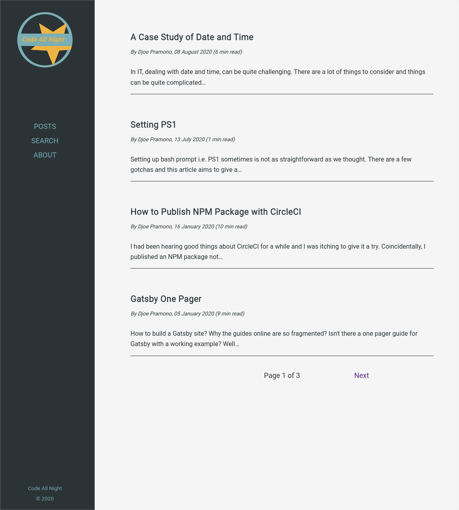
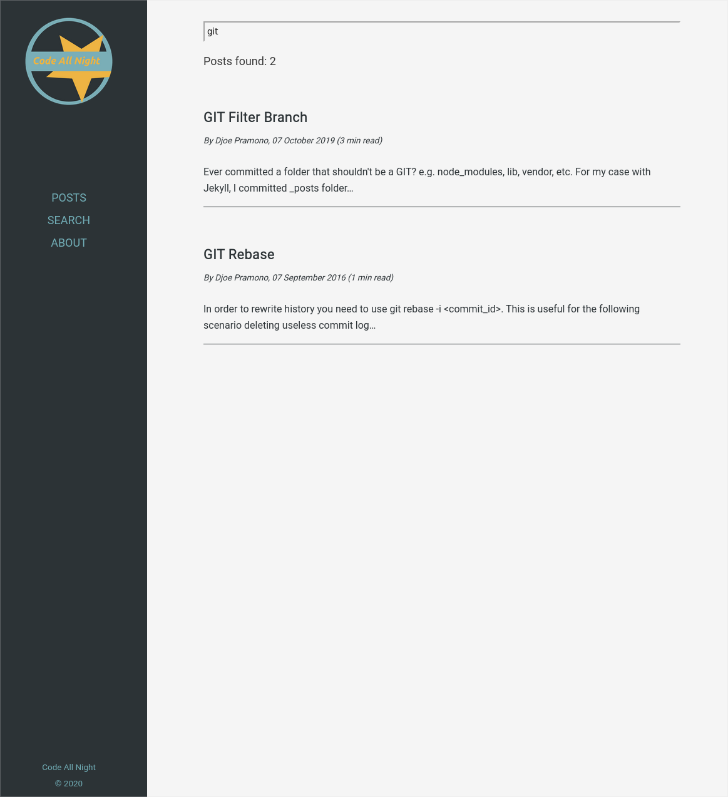
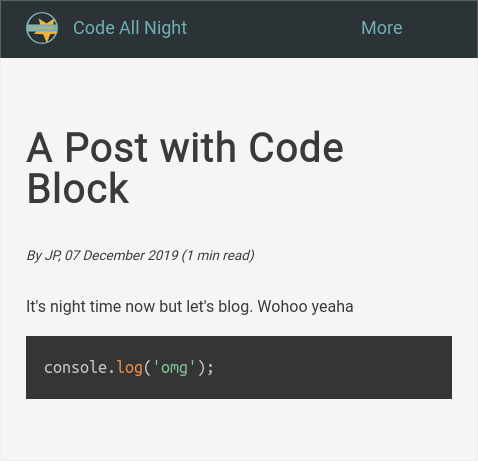

# Code All Night

This repository is powering https://www.codeallnight.com and it is built on top of [Gatsby](https://www.gatsbyjs.org/)

Features:
- [x] Client side search
- [x] Pagination
- [x] Google analytics
- [x] Code highlighting
- [x] Responsive design

It's still a work in progress with more stuffs coming soon. Meanwhile feel free to have a look, built on it, and even contribute.

# Development

```
gatsby develop -H 0.0.0.0
```

For more information please refer to the [guide](https://www.codeallnight.com/posts/gatsby-one-pager)

# Screenshots



